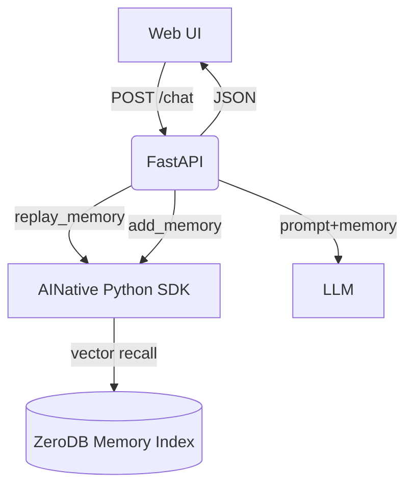

# Scout — ZeroMemory Demo (AINative Memory for Agents)

A tiny chat agent that **saves**, **replays**, and **uses** memory to produce contextual replies.
Built for the class: **“Mastering the AI-Native Stack — Memory & Replay”**

> You’ll learn how to: store memories, replay with **vector + recency**, inject them into prompts, and reinforce useful memories.

---

## TL;DR (Quickstart)

```bash
# 1) Clone
git clone <THIS_REPO_URL> scout && cd scout

# 2) Backend (Python 3.10+)
python -m venv .venv && source .venv/bin/activate   # Windows: .venv\Scripts\activate
pip install -U pip
pip install -r backend/requirements.txt || pip install fastapi "uvicorn[standard]" httpx pydantic python-dotenv ainative-python

# 3) Configure
cp backend/.env.example backend/.env
# then edit backend/.env:
# AINATIVE_API_KEY=<your key>   # or set USE_MOCK_ADAPTER=true
# LLM_URL=http://localhost:11434/v1/chat/completions  # any OpenAI-compatible endpoint

# 4) Run backend
uvicorn backend.app:app --reload --port 8000

# 5) Frontend (Node 18+)
cd frontend
npm i
npm run dev  # starts Vite dev server on http://localhost:5173
```

Open **[http://localhost:5173](http://localhost:5173)** → chat on the left, **Replayed Memory** panel on the right.

---

## Class Flow (60–75 minutes)

**0–5m** Welcome & goals
**5–15m** Setup + health checks
**15–45m** Labs 1–4: Save → Replay → Hybrid Scoring → Inject
**45–60m** Labs 5–6: Feedback → (Optional) MCP memory injection
**60–75m** Q\&A and “with vs without memory” demo

---

## Learning Objectives

* Save agent interactions as memory entries
* Use `/memory/replay` semantics via the **AINative Python SDK** (semantic search + recency)
* Build prompts that leverage replayed context
* Filter by type/scope and re-rank by **vector × recency**
* Inject replayed memory into LLM calls or MCP tools
* Reinforce helpful memories with feedback

---

## Architecture (at a glance)

```
frontend (Vite/React)
  ├─ Chat UI
  └─ Memory panel (read-only, shows type/text/score)

backend (FastAPI)
  ├─ POST /chat       → adapter.replay() → prompt → LLM → adapter.add()
  ├─ POST /feedback   → adapter.feedback()
  ├─ GET  /memories   → list last N memories (dev)
  └─ GET  /healthz    → { status, adapter: sdk|mock }

AINativeAdapter (Python)
  ├─ add_memory()
  ├─ replay_memory()  # semantic search + recency decay re-rank
  ├─ list_memories()
  └─ feedback()
```

**Mermaid**:



---

## Prerequisites

* **Python** 3.10+
* **Node** 18+ and **npm**
* **AINATIVE\_API\_KEY** (recommended) or set `USE_MOCK_ADAPTER=true` to run without the cloud API
* **LLM** endpoint (any OpenAI-compatible `/v1/chat/completions` URL).

  * Example local endpoints work great (LM Studio, Ollama proxies, etc.).
  * If you don’t have one, you can still complete Labs 1–3 using cURL + the Memory panel.

---

## Configuration

Create `backend/.env`:

```ini
# AINative (set either API key OR use the mock adapter)
AINATIVE_API_KEY=your_key_here
# USE_MOCK_ADAPTER=true   # uncomment to run fully offline with fake persistence

# LLM (OpenAI-compatible /v1/chat/completions)
LLM_URL=http://localhost:11434/v1/chat/completions
LLM_MODEL=gpt-4o-mini
LLM_TEMPERATURE=0.5

# Replay strategy
MEMORY_HALFLIFE_HOURS=72
DEFAULT_TOP_K=5
```

> **Tip:** In class, we’ll start with `USE_MOCK_ADAPTER=true` to verify UI/flow, then switch to a real key.

---

## Health Checks

Backend:

```bash
curl -s http://localhost:8000/healthz | jq
# → { "ok": true, "adapter": "sdk" | "mock" }
```

Frontend: open `http://localhost:5173` (you should see the chat UI).

---

## Labs

### Lab 1 — Save memory entries

1. In the chat box, send:

```
I'm vegan and I hate early morning meetings.
```

2. The backend saves memories like:

* `type: preference, text: "I'm vegan ..."`
* `type: preference, text: "I hate early morning meetings"`

**Inspect (dev):**

```bash
curl "http://localhost:8000/memories?scope=session&limit=10" | jq
```

---

### Lab 2 — Replay top-k by semantic match

Ask:

```
Plan lunch and a review.
```

The **Replayed Memory** panel should show matches such as:

* preference: “I’m vegan…”
* (later) fact/task items

Toggle **Use memory** OFF and ask again → notice the bland reply.

---

### Lab 3 — Hybrid scoring (vector × recency)

Teach a near-term task:

```
My pitch is on Friday at 10am.
```

Ask again:

```
Plan lunch and a review.
```

You should now see **both**: vegan and the Friday pitch, ranked by similarity × recency (pitch is recent → higher score).

---

### Lab 4 — Prompt injection

Open **Network tab** or logs to see the prompt block:

```
[MEMORY CONTEXT]
- preference: User is vegan
- fact: Pitch on Friday 10am
[/MEMORY CONTEXT]
```

Observe how the response references that context when **Use memory** is ON.

---

### Lab 5 — Feedback & reinforcement

In the Memory panel, click 👍 on the most helpful memory
(or via cURL):

```bash
curl -X POST http://localhost:8000/feedback \
  -H "Content-Type: application/json" \
  -d '{"memory_id":"<id>","signal":"+1","reason":"Relevant to planning"}'
```

This records a positive signal (and may bump priority in future queries).

---

### Lab 6 (Optional) — MCP injection

Pass replayed memory to a tool as context:

```json
{
  "tool": "calendar.schedule",
  "args": {
    "title": "Pitch dry run",
    "when": "Thursday 3pm",
    "context": {
      "replayed_memory": [
        {"type":"task","text":"Pitch on Friday 10am"},
        {"type":"preference","text":"No early meetings"}
      ]
    }
  }
}
```

---

## API (Demo Backend)

### `POST /chat`

**Request**

```json
{
  "user_id":"u1",
  "session_id":"s1",
  "agent_id":"scout",
  "message":"Plan lunch + review",
  "use_memory": true,
  "top_k": 5
}
```

**Response**

```json
{
  "reply": "Let's pick a vegan-friendly spot. Your pitch is Friday 10am...",
  "replayed_memory": [
    {"id":"m1","type":"preference","content":"User is vegan","score":0.87},
    {"id":"m2","type":"fact","content":"Pitch on Friday 10am","score":0.82}
  ]
}
```

### `POST /feedback`

```json
{"memory_id":"m2","signal":"+1","reason":"Relevant to planning"}
```

### `GET /memories?scope=session|global&limit=50`

```json
{"items":[{"id":"m1","type":"preference","content":"..."}]}
```

### `GET /healthz`

```json
{"ok": true, "adapter": "sdk"}
```

---

## Repo Structure

```
scout/
  backend/
    app.py
    adapter/
      ainative_adapter.py
      mock_adapter.py
    tests/
      test_adapter.py
      test_chat_e2e.py
    .env.example
  frontend/
    src/App.tsx
    src/components/Chat.tsx
    src/components/MemoryPanel.tsx
    src/lib/api.ts
    vite.config.ts
  README.md
```

---

## Instructor “Cheat Codes”

* **Seed script** (optional):

  ```bash
  python backend/seed_memories.py  # drops in vegan + pitch examples
  ```
* **Reset session**: Refresh the page, or change `session_id` in localStorage (dev tools).
* **With vs Without**: Use the top-bar **Use memory** toggle for a dramatic contrast.

---

## Troubleshooting

* **401 / 403 from AINative**
  Check `AINATIVE_API_KEY`. For offline class, set `USE_MOCK_ADAPTER=true`.

* **CORS error**
  Start backend first, then frontend. Backend default: `http://localhost:8000`.

* **LLM call fails**
  Set a reachable `LLM_URL` (OpenAI-compatible). You can still complete Labs 1–3 without an LLM by using the Memory panel and cURL.

* **No memories appear**
  Make sure your first messages include obvious preferences or tasks (e.g., “I’m vegan…”, “Pitch Friday 10am”).

---

## Extending (after class)

* Replace the regex extractor with an **LLM memory-candidate extractor**.
* Add a **Session vs Global** scope switch (UI shows both modes).
* Use `get_related(memory_id)` to enrich prompts with near neighbors.

---

## License

MIT (unless your org policy specifies otherwise).

---

**Have fun building smarter agents that remember.**
